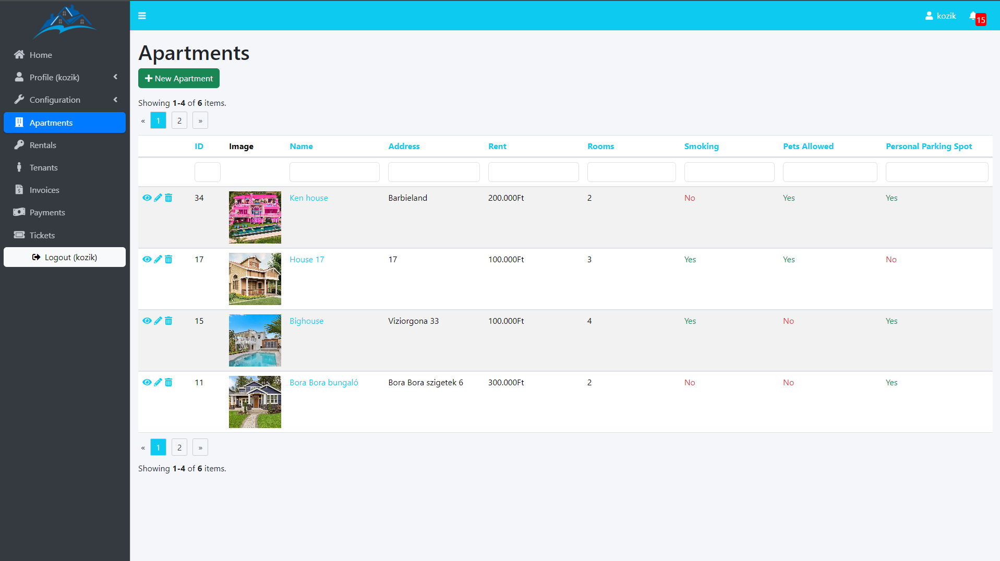

Landlord is a web application for managing apartments for rental.

1. Setup Yii using Docker: https://www.yiiframework.com/extension/yiisoft/yii2-app-advanced/doc/guide/2.0/en/start-installation#installing-using-docker
2. Create a user (read from step 7): https://www.yiiframework.com/extension/yiisoft/yii2-app-advanced/doc/guide/2.0/en/start-installation#preparing-application
3. I added phpMyAdmin to Docker if you prefer using it

